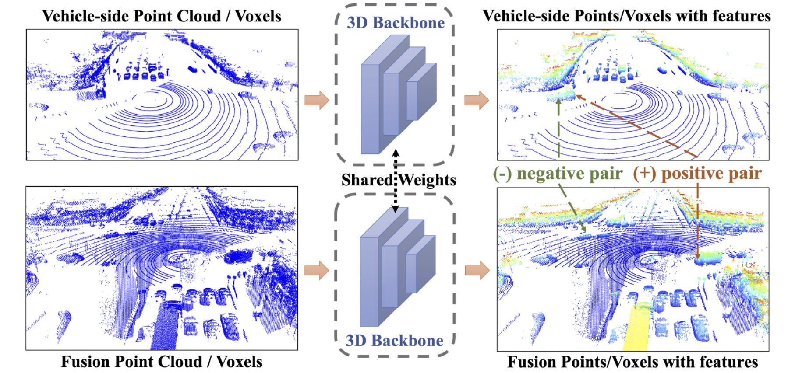
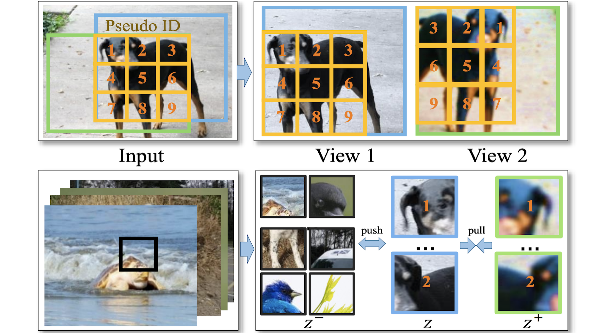
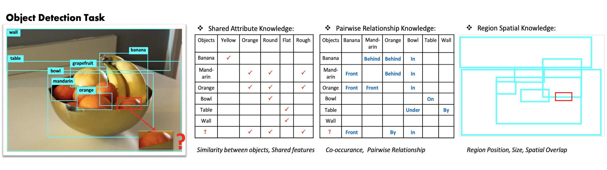
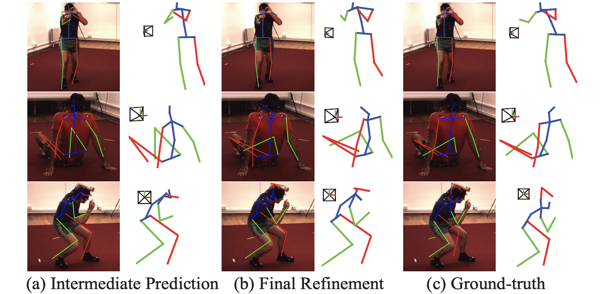

I am a second-year Ph.D. student at the Department of Computer Science and Engineering, the Hong Kong University of Science and Technology (HKUST), supervised by <a href="https://sites.google.com/view/dyyeung/home">Prof. Dit-Yan Yeung</a>.
Before that, I obtained a Master's degree at <a href="https://www.sysu-hcp.net/">Human-Cyber-Physical Intelligence Integration Lab</a> of Sun Yat-san University in 2019, supervised by <a href="http://www.linliang.net/">Prof. Liang Lin</a> and <a href="https://lemondan.github.io/">Prof. Xiaodan Liang</a>.

My current research interest are 3D generation and perception, including text-to-3D generation, scene understanding. I did some works on 2D/3D detection and representation learning.

I am looking for summer Intern! Please feel free to reach out :)

## News
- **[02/2023]:** One paper, is accepted to CVPR 2023.
- **[01/2023]:** One paper, is accepted to ICLR 2023.
- **[09/2022]:** I started my Ph.D. journey at HKUST.

## Publications
(* indicates equal contribution)

<dl>
<dt><strong>3D Generation </strong> </dt>
<dt></dt>
<dt>JointDreamer: Ensuring Geometry Consistency and Text Congruence in Text-to-3D Generation via Joint Score Distillation</dt>
<dd><strong>Chenhan Jiang*</strong>, Yihan Zeng*, Tianyang Hu, Songcen Xu, Wei Zhang, Dit-Yan Yeung, Hang Xu</dd>
<dd>arXiv Preprint, 2023</dd>
<dd><a href="https://jointdreamer.github.io/">[Project]</a></dd>

<dt></dt>
<dt>Fast-T3D: Fast Text-to-3D Object Generation via  Scarce 3D Prior and Multi-Gradient Optimization</dt>
<dd><strong>Chenhan Jiang*</strong>, Yihan Zeng*, Jianhua Han, Songcen Xu, Wei Zhang, Dit-Yan Yeung, Hang Xu</dd>
<dd>arXiv Preprint, 2023</dd>
</dl>

<dl>
<dt><strong>3D Representation Learning </strong> </dt>
<dt></dt>
<dt>CO3: Cooperative Unsupervised 3D Representation Learning for Autonomous Driving</dt>
<dd>Runjian Chen, Yao Mu, Runsen Xu, Wenqi Shao, <strong>Chenhan Jiang</strong>, Hang Xu, Zhenguo Li, Pin Luo</dd>
<dd>ICLR, 2023</dd>
<dd><a href="https://arxiv.org/pdf/2206.04028">[Paper]</a>&nbsp;<a href="https://github.com/Runjian-Chen/CO3">[Code]</a></dd>

<dt></dt>
<dt>CLIP2: Contrastive Language-Image-Point Pretraining from Real-World Point Cloud Data</dt>
<dd>Yihan Zeng*, <strong>Chenhan Jiang*</strong>, Jiageng Mao, Jianhua Han, Chaoqiang Ye, Qingqiu Huang, Dit-Yan Yeung, Zhen Yang, Xiaodan Liang, Hang Xu</dd>
<dd>CVPR, 2023</dd>
<dd><a href="https://openaccess.thecvf.com/content/CVPR2023/papers/Zeng_CLIP2_Contrastive_Language-Image-Point_Pretraining_From_Real-World_Point_Cloud_Data_CVPR_2023_paper.pdf">[Paper]</a></dd>

<dt></dt>
<dt>One Million Scenes for Autonomous Driving: ONCE Dataset</dt>
<dd>Jiageng Mao*, Minzhe Niu*, <strong>Chenhan Jiang</strong>, Hanxue Liang, Jingheng Chen, Xiaodan Liang, Yamin Li, Chaoqiang Ye, Wei Zhang, Zhenguo Li, Jie Yu, Chunjing Xu, Hang Xu</dd>
<dd>NeurIPS Dataset and Benchmark, 2022</dd>
<dd><a href="https://arxiv.org/abs/2106.11037">[Paper]</a>&nbsp;<a href="https://github.com/PointsCoder/ONCE_Benchmark">[Code]</a></dd>

<dt></dt>
<dt>Exploring Geometry-Aware Contrast and Clustering Harmonization for Self-supervised 3d Object Detection</dt>
<dd>Hanxue Liang*, <strong>Chenhan Jiang*</strong>, Dapeng Feng, Xin Chen, Hang Xu, Xiaodan Liang, Wei Zhang, Zhenguo Li, Luc Van Gool</dd>
<dd>ICCV, 2021</dd>
<dd><a href="http://openaccess.thecvf.com/content/ICCV2021/papers/Liang_Exploring_Geometry-Aware_Contrast_and_Clustering_Harmonization_for_Self-Supervised_3D_Object_ICCV_2021_paper.pdf">[Paper]</a></dd>
</dl>

<dl>
<dt><strong>2D Object Detection</strong> </dt>
<dt></dt>
<dt>Deeply Unsupervised Patch Re-Identification for Pre-training Object Detectors</dt>
<dd>Jian Ding*, Enze Xie*, Hang Xu, <strong>Chenhan Jiang</strong>, Zhenguo Li, Ping Luo, Gui-Song Xia</dd>
<dd>TPAMI, 2022</dd>
<dd><a href="https://arxiv.org/abs/2103.04814">[Paper]</a>&nbsp;<a href="https://github.com/dingjiansw101/DUPR">[Code]</a></dd>
 
<dt></dt>
<dt>SP-NAS: Serial-to-Parallel Backbone Search for Object Detection</dt>
<dd><strong>Chenhan Jiang</strong>, Hang Xu, Xiaodan Liang, Wei Zhang, Zhenguo Li</dd>
<dd>CVPR, 2020</dd>
<dd><a href="http://openaccess.thecvf.com/content_CVPR_2020/papers/Jiang_SP-NAS_Serial-to-Parallel_Backbone_Search_for_Object_Detection_CVPR_2020_paper.pdf">[Paper]</a>&nbsp;<a href="https://github.com/huawei-noah/vega/blob/master/docs/en/algorithms/sp_nas.md">[Code]</a></dd>

<dt></dt>
<dt>Spatial-Aware Graph Relation Network for Large-scale Object Detection</dt>
<dd>Hang Xu*, <strong>Chenhan Jiang*</strong>, Xiaodan Liang, Zhenguo Li</dd>
<dd>CVPR, 2019</dd>
<dd><a href="https://openaccess.thecvf.com/content_CVPR_2019/papers/Xu_Spatial-Aware_Graph_Relation_Network_for_Large-Scale_Object_Detection_CVPR_2019_paper.pdf">[Paper]</a>&nbsp;<a href="https://github.com/chanyn/HKRM">[Code]</a></dd>

<dt></dt>
<dt>Reasoning-RCNN: Unifying Adaptive Global Reasoning into Large-scale Object Detection</dt>
<dd>Hang Xu*, <strong>Chenhan Jiang*</strong>, Xiaodan Liang, Liang Lin, Zhenguo Li</dd>
<dd>CVPR, 2019</dd>
<dd><a href="https://openaccess.thecvf.com/content_CVPR_2019/papers/Xu_Reasoning-RCNN_Unifying_Adaptive_Global_Reasoning_Into_Large-Scale_Object_Detection_CVPR_2019_paper.pdf">[Paper]</a>&nbsp;<a href="https://github.com/chanyn/HKRM">[Code]</a></dd>
 
<dt></dt>
<dt>Hybrid Knowledge Routed Modules for Large-scale Object Detection</dt>
<dd><strong>Chenhan Jiang*</strong>, Hang Xu*, Xiaodan Liang, Liang Lin</dd>
<dd>NeurIPS, 2018</dd>
<dd><a href="https://proceedings.neurips.cc/paper/2018/file/72da7fd6d1302c0a159f6436d01e9eb0-Paper.pdf">[Paper]</a>&nbsp;<a href="https://github.com/chanyn/HKRM">[Code]</a></dd>
</dl>

<dl>
<dt><strong>Others</strong> </dt>
<dt></dt>
<dt>How to Save your Annotation Cost for Panoptic Segmentation?</dt>
<dd>Xuefeng Du, <strong>Chenhan Jiang</strong>, Hang Xu, Gengwei Zhang, Zhenguo Li</dd>
<dd>AAAI, 2021</dd>
<dd><a href="https://ojs.aaai.org/index.php/AAAI/article/view/16216">[Paper]</a></dd>

<dt></dt>
<dt>Elixirnet: Relation-Aware Network Architecture Adaptation for Medical Lesion Detection</dt>
<dd><strong>Chenhan Jiang*</strong>, Shaoju Wang*, Hang Xu, Xiaodan Liang, Nong Xiao</dd>
<dd>AAAI, 2020</dd>
<dd><a href="https://arxiv.org/abs/2003.08770">[Paper]</a></dd>

<dt></dt>
<dt>3D Human Pose Machines with Self-Supervised Learning</dt>
<dd>Keze Wang, Liang Lin, <strong>Chenhan Jiang</strong>, Chen Qian, Pengxu Wei</dd>
<dd>TPAMI, 2019</dd>
<dd><a href="https://arxiv.org/abs/1901.03798">[Paper]</a>&nbsp;<a href="https://github.com/chanyn/3Dpose_ssl">[Code]</a></dd>
 
<dt></dt>
<dt>Layout-Graph Reasoning for Fashion Landmark Detection</dt>
<dd>Weijiang Yu, Xiaodan Liang, Ke Gong, <strong>Chenhan Jiang</strong>, Nong Xiao, Liang Lin</dd>
<dd>CVPR, 2019</dd>
<dd><a href="http://openaccess.thecvf.com/content_CVPR_2019/papers/Yu_Layout-Graph_Reasoning_for_Fashion_Landmark_Detection_CVPR_2019_paper.pdf">[Paper]</a></dd>

</dl>
 

## Experiences

  
  

    
Researcher, Huawei Noah's Ark Lab

    
Dec. 2019 - Jun. 2022

  

  
  

    
Research Intern, SenseTime

    
Jan. 2018 - Dec. 2018

  

## Selected Awards

  
HKUST RedBird PhD Award

  
2022

  
Huawei PhD Fellowship Award

  
2022

  
Rank 1 in <a href="https://waymo.com/open/challenges/2020/2d-detection/">Waymo 2D Detection Challenge</a>

  
2021

  
Huawei Director Award-Outstanding New Employees

  
2020

  
Rank 1 in 
    <a href="https://tianchi.aliyun.com/competition/entrance/231677/rankingList">Tianchi Zero-shot Image Classification Competition</a>

    
(bonus 500,000 RMB)

  
2018

